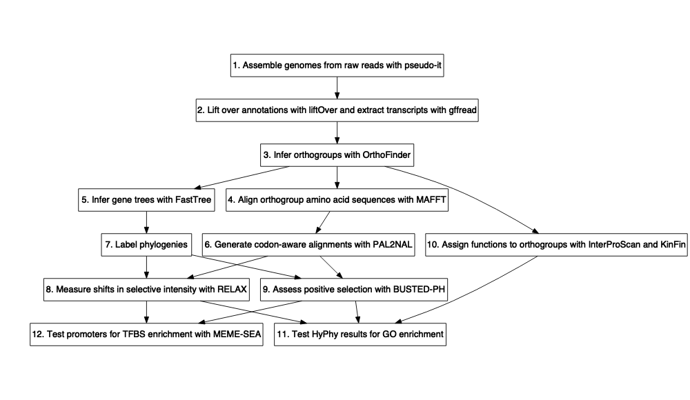

Reference-guided genome assembly and comparative genomics workflow
================
Megan Barkdull

## Introduction

The goal of this project is to sequence five new genomes from the ant
genus *Cephalotes*, assemble them to the reference *C. varians* genome,
and then use these data to better understand the genetic basis of caste
polymorphism.

The general workflow of this project is as
follows:

## Citing

This workflow implements many different tools, all of which should be
cited. I have noted appropriate citations throughout the text of this
ReadMe. Please properly credit these researchers’ hard work\!

In addition, if this workflow has been useful to you, please cite the
Github
repository:

## Reference-guided genome assembly

Reference-guided genome assembly involves mapping raw reads to a
reference genome and generating a consensus sequence. We will do this
iteratively using the tool
[pseudo-it](https://github.com/goodest-goodlab/pseudo-it#citation),
implemented in the bash script `./Scripts/runPseudoit`. This script
requires two arguments:

1.  The full path to your reference genome fasta file
2.  The full path to a directory containing directories for each of the
    newly sequenced genomes you wish to assemble.

The script will pre-index your reference genome with samtools, BWA, and
Picard, then run pseudo-it. You will get two important outputs, (1) a
final genome assembly and (2) a chain file that can be used to lift over
annotations from the reference genome to your new genome. Outputs are in
the directory `01_pseudo-it`.

If you use this script, please cite pseudo-it and all of the tools it
implements:

  - Sarver BAJ, Keeble S, Cosart T, Tucker PK, Dead MD, Good JM. 2017.
    Phylogenomic insights into mouse evolution using a pseudoreference
    approach. Genome Biology and Evololution.
    <https://doi.org/10.1093/gbe/evx034>.
  - Li H. (2013) Aligning sequence reads, clone sequences and assembly
    contigs with BWA-MEM. arXiv:1303.3997v2 \[q-bio.GN\].
  - Danecek, P., Bonfield, J. K., Liddle, J., Marshall, J., Ohan, V.,
    Pollard, M. O., … & Li, H. (2021). Twelve years of SAMtools and
    BCFtools. Gigascience, 10(2), giab008.
  - McKenna, Aaron, et al. “The Genome Analysis Toolkit: a MapReduce
    framework for analyzing next-generation DNA sequencing data.” Genome
    research 20.9 (2010): 1297-1303.
  - Quinlan, Aaron R., and Ira M. Hall. “BEDTools: a flexible suite of
    utilities for comparing genomic features.” Bioinformatics 26.6
    (2010): 841-842.
  - Li, Heng. “Tabix: fast retrieval of sequence features from generic
    TAB-delimited files.” Bioinformatics 27.5 (2011): 718-719.

## Processing assembled genomes

Once genomes are assembled to the reference, we want to identify gene
sequences in those new genomes. To do this, we will lift over the
reference annotation onto the new genomes, and extract transcript
sequences. You can do this using the R script `./Scripts/gffread/`,
which uses liftOver to lift over the annotation, gffread to extract
transcript sequences, extracts CDS sequences, and also translates the
CDS sequences for input to OrthoFinder. The results of this step will be
in `./02_annotationsAndExons/`, which contains a single directory for
each species.

If you use this script, please cite:

  - Hinrichs, Angela S., et al. “The UCSC genome browser database:
    update 2006.” Nucleic acids research 34.suppl\_1 (2006): D590-D598.
  - Pertea, Geo, and Mihaela Pertea. “GFF utilities: GffRead and
    GffCompare.” F1000Research 9 (2020): 304.

## Identifying evolutionary changes associated with phenotypes

Now, we can move on to using our gene sequences to understand how
genomes are evolving in association with a phenotype of interest.

### Identifying orthogroups with OrthoFinder

The first step in doing so is to identify groups of orthologous genes,
eg. genes which are descended from a single gene in the last common
ancestor of your species. We’ll do this with OrthoFinder, running on the
amino acid sequences generated by `./Scripts/gffread/`. We will also an
outgroup in our analysis, to improve orthogroup inference accuracy. This
component is currently hard-coded, on lines 25-27 of the script
`./Scripts/runOrthofinder`.

You can run OrthoFinder on your list of samples with the script
`./Scripts/runOrthofinder`, which takes two inputs:

  - the maximum number of threads to use on computer
  - the full path to the protein sequence file for your reference
    species.

Outputs will be found in the directory `03_OrthoFinder`.

If you use this script, please cite:

  - Emms D.M. & Kelly S. (2019), Genome Biology 20:238

If you use the species tree in your work then please also cite:

  - Emms D.M. & Kelly S. (2017), MBE 34(12): 3267-3278
  - Emms D.M. & Kelly S. (2018), bioRxiv
    <https://doi.org/10.1101/267914>

### Aligning orthogroup sequences and inferring gene trees

We need to align the orthogroup sequences, and then infer a gene tree
for each orthogroup. You can do this using the script
`./Scripts/aligningHOGsAndInferringTree`, which will run MAFFT and
FastTree on each orthogroup to produced a multiple sequence alignment
and a gene tree. This script takes two command-line options,

  - the path to the hierarchical orthogroups to analyze, and
  - the number of threads to use for this step.

Outputs will be in two directories, `04_alignedHOGs` and `05_HOGTrees`.

If you use this script, please cite:

  - Katoh, Kazutaka, et al. “MAFFT: a novel method for rapid multiple
    sequence alignment based on fast Fourier transform.” Nucleic acids
    research 30.14 (2002): 3059-3066.
  - Price, Morgan N., Paramvir S. Dehal, and Adam P. Arkin. “FastTree
    2–approximately maximum-likelihood trees for large alignments.”
    PloS one 5.3 (2010): e9490.

### Producing codon-aware nucleotide sequence alignments

Now that we have aligned amino acid sequences, we need to use them to
align our nucleotide sequences in a codon-aware fashion. You can do this
with the R script `./Scripts/prepRunParsePAL2NAL.R`. Your aligned
nucleotide sequences, combined into orthogroups, will be output in
`./06_AlignedNucleotideOrthogroups/alignedOrthogroupNucleotideSequences`.

If you use this script, please cite:

  - Mikita Suyama, David Torrents, and Peer Bork (2006) PAL2NAL: robust
    conversion of protein sequence alignments into the corresponding
    codon alignments. Nucleic Acids Res. 34, W609-W612.

### Evolutionary analyses in Hyphy

#### Prepping data for Hyphy

##### Labelling phylogenies with foreground species and nodes

The Hyphy analyses will need labelled gene trees for each orthogroup,
with the tips (and internal nodes, if appropriate) that possess your
focal trait labelled as being the foreground. You can produce these
labelled trees using the R script `./Scripts/labellingPhylogenies.R`,
which runs a built-in Hyphy utility to label trees across all of the
trees in the directory `./05_HOGTrees/`. The labelled phylogenies will
be found in the directory `07_labelledPhylogenies`.

The gene trees from Orthofinder have species labels appended to each
gene name, causing them not to match the gene names in the orthogroup
sequences files. To correct this, run the R script
`./Scripts/removingTreePrefixes.R`.

#### Assessing positive selection with BUSTED-PH

#### Assessing shifts in selection intensity with RELAX

### Exploring evolution in non-coding elements

<https://onlinelibrary.wiley.com/doi/full/10.1111/mec.15982>
